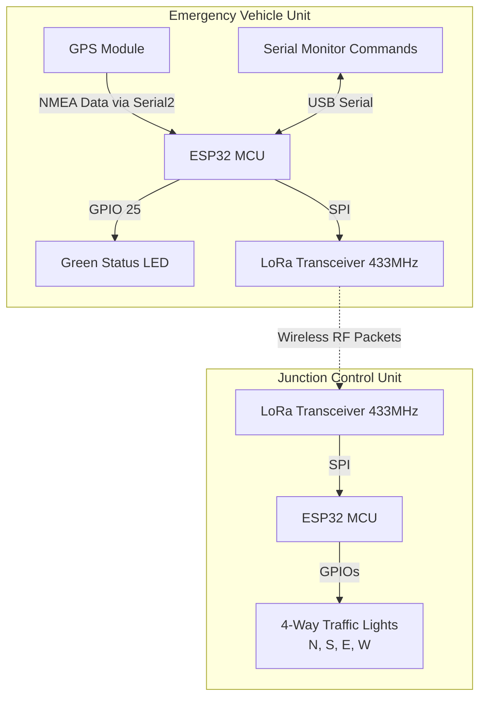

# LoRa & GPS-Based Emergency Vehicle Priority Traffic Control System

This project is an IoT-based Smart Traffic Control System designed to prioritize emergency vehicles (such as ambulances, fire trucks, or police cars) at a 4-way traffic junction. The system comprises two main components:
1. **Transmitter (Emergency Vehicle Unit)**: Reads real-time GPS data, determines the vehicle's heading, and broadcasts this information over LoRa.
2. **Receiver (Junction Control Unit)**: Listens for incoming LoRa transmissions and overrides the normal traffic light cycle to give green-light priority to the approaching emergency vehicle's direction.

---

## 🏗️ System Architecture



---

## 🛠️ Hardware Requirements

*   **ESP32 Development Board** (2x)
*   **LoRa SX1278 Transceiver Module (433 MHz)** (2x)
*   **GPS Module (e.g., Neo-6M)** (1x)
*   **LEDs**:
    *   1x Green LED (for Transmitter status indicator)
    *   4x Red LEDs & 4x Green LEDs (for 4-Way Traffic Lights)
*   **Resistors (220Ω)** (9x)
*   **Breadboards & Jumper Wires**

---

## 📌 Pin Configurations & Wiring

### 1. Transmitter Module (Vehicle Unit)
The transmitter requires connections for the LoRa module, GPS module, and a status LED.

| Component | ESP32 Pin | LoRa Pin / GPS Pin | Notes |
| :--- | :--- | :--- | :--- |
| **LoRa (SPI)** | `GPIO 5` | NSS / CS | Chip Select |
| | `GPIO 14` | RST | Reset |
| | `GPIO 26` | DIO0 | Interrupt Pin |
| | `GPIO 18` | SCK | SPI Clock |
| | `GPIO 19` | MISO | SPI Master In Slave Out |
| | `GPIO 23` | MOSI | SPI Master Out Slave In |
| | `3.3V` | VCC | **Do not connect to 5V!** |
| | `GND` | GND | Ground |
| **GPS (UART)** | `GPIO 16` | TX | ESP32 Hardware Serial 2 RX |
| | `GPIO 17` | RX | ESP32 Hardware Serial 2 TX |
| | `3.3V/5V` | VCC | Power |
| | `GND` | GND | Ground |
| **LED** | `GPIO 25` | Anode (+) | Status LED (with 220Ω resistor) |

### 2. Receiver Module (Junction Control Unit)
The receiver governs the LoRa module and 4 pairs of Red and Green LEDs representing the traffic lights.

| Component | ESP32 Pin | Traffic Light LED / LoRa Pin | Description |
| :--- | :--- | :--- | :--- |
| **LoRa (SPI)** | `GPIO 27` | NSS / CS | Chip Select |
| | `GPIO 25` | RST | Reset |
| | `GPIO 26` | DIO0 | Interrupt Pin |
| | `GPIO 18` | SCK | SPI Clock |
| | `GPIO 19` | MISO | SPI Master In Slave Out |
| | `GPIO 23` | MOSI | SPI Master Out Slave In |
| **North Signal**| `GPIO 2` | North RED LED | Traffic Light (North) |
| | `GPIO 5` | North GREEN LED | |
| **South Signal**| `GPIO 12` | South RED LED | Traffic Light (South) |
| | `GPIO 14` | South GREEN LED | |
| **East Signal** | `GPIO 15` | East RED LED | Traffic Light (East) |
| | `GPIO 22` | East GREEN LED | |
| **West Signal** | `GPIO 32` | West RED LED | Traffic Light (West) |
| | `GPIO 13` | West GREEN LED | |

---

## 📂 Codebase Overview

The codebase is split into two directories:
*   [`TRANSMITTER/TRANSMITTER.ino`](file:///d:/rit%20seed%20project/TRANSMITTER/TRANSMITTER.ino): Code running on the emergency vehicle's ESP32.
*   [`RECEIVER/RECEIVER.ino`](file:///d:/rit%20seed%20project/RECEIVER/RECEIVER.ino): Code running on the traffic junction's ESP32.

### Third-Party Library Dependencies
Ensure you install these libraries in your Arduino IDE before uploading:
1. **LoRa** (by Sandeep Mistry) - For LoRa packet communication.
2. **TinyGPSPlus** (by Mikal Hart) - For parsing NMEA sentences from the GPS module.

---

## ⚙️ How It Works

### 1. Normal Mode (Traffic Cycle)
When no emergency vehicle is detected, the receiver runs in `NORMAL` mode. It cycles the green light sequentially across all four directions for **5 seconds** each:
$$\text{North} \rightarrow \text{South} \rightarrow \text{East} \rightarrow \text{West}$$
While one direction is Green, the remaining three are kept Red.

### 2. LoRa Data Packet Structure
The Transmitter continuously reads GPS location and calculates the cardinal direction based on the heading angle (course). Every 1 second, it constructs a packet formatted as:
```text
[UnitID],LAT=[latitude],LON=[longitude],DIR=[CardinalDirection]
```
*   **Example Packet**: `N01,LAT=9.450060,LON=77.564244,DIR=NW`
*   **Direction Logic**: Heading degrees (from TinyGPSPlus) are converted to one of: `N`, `NE`, `E`, `SE`, `S`, `SW`, `W`, `NW`. If there is no GPS lock, the direction defaults to `N/A`.

### 3. Priority Mode (Emergency Override)
Upon receiving a LoRa packet, the Receiver:
1.  Checks if the incoming packet's `UnitID` matches its configured target `unitID` (default: `"N01"`).
2.  If it matches, the receiver switches to `PRIORITY` mode.
3.  It parses the `DIR` value and overrides the signals:
    *   **`N` / `NE` / `NW`** $\rightarrow$ Turns **North** Green (others Red).
    *   **`S` / `SE` / `SW`** $\rightarrow$ Turns **South** Green (others Red).
    *   **`E`** $\rightarrow$ Turns **East** Green (others Red).
    *   **`W`** $\rightarrow$ Turns **West** Green (others Red).
    *   **`N/A`** $\rightarrow$ Keeps **All Red** for safety (no direction lock).

> [!TIP]
> **Timeout Safety Mechanism**: If no matching LoRa packet is received for **3 seconds** (meaning the vehicle has passed or stopped transmitting), the receiver automatically reverts back to `NORMAL` mode and resumes the regular cycle.

---

## 💻 Serial Command Interface (Transmitter)

You can send text commands to the Transmitter through the Arduino Serial Monitor (baud rate: `115200`) to control its state:

| Command | Action | Green LED Status |
| :--- | :--- | :--- |
| `START` | Starts broadcasting GPS packets over LoRa. | **ON** |
| `END` | Stops broadcasting GPS packets. | **OFF** |
| `[UnitID]-START` <br> *(e.g., `N01-START`)* | Updates target unit ID and starts transmission. | **ON** |
| `[UnitID]-END` <br> *(e.g., `N01-END`)* | Updates target unit ID and halts transmission. | **OFF** |

---

## 🚀 Setup & Deployment Guide

1.  **Library Installation**:
    *   Open Arduino IDE $\rightarrow$ **Library Manager** (`Ctrl+Shift+I`).
    *   Search and install **LoRa** (by Sandeep Mistry).
    *   Search and install **TinyGPSPlus** (by Mikal Hart).
2.  **Board Configuration**:
    *   Install ESP32 Board Support: **File** $\rightarrow$ **Preferences** $\rightarrow$ Add `https://raw.githubusercontent.com/espressif/arduino-esp32/gh-pages/package_esp32_index.json` to Additional Boards Manager URLs.
    *   Go to **Tools** $\rightarrow$ **Board** $\rightarrow$ **Boards Manager** and install `esp32`.
    *   Select **ESP32 Dev Module** from the board selection menu.
3.  **Uploading the Firmware**:
    *   Connect the Transmitter ESP32 to your PC, open [`TRANSMITTER/TRANSMITTER.ino`](file:///d:/rit%20seed%20project/TRANSMITTER/TRANSMITTER.ino), select the COM port, and upload.
    *   Connect the Receiver ESP32 to your PC, open [`RECEIVER/RECEIVER.ino`](file:///d:/rit%20seed%20project/RECEIVER/RECEIVER.ino), select the COM port, and upload.
4.  **Testing**:
    *   Keep the Transmitter serial monitor open to verify GPS lock and LoRa status.
    *   Use the serial commands (`START` / `END`) to simulate emergency vehicle status transitions.
    *   Observe the traffic light LEDs on the Receiver to verify normal cycles and emergency overrides.
